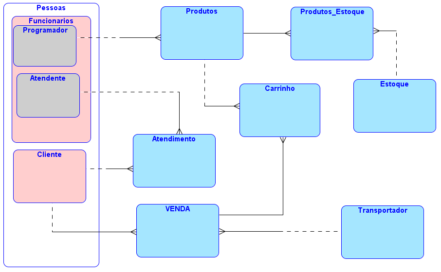

# CC1N - BANCO DE DADOS - UVV
Componentes: **Gustavo Contarato Sant'anna, Leandro dos Santos de Abreu, Rafael Guimarães Vendros**

## ENTIDADES:
* **Pessoas:** *Funcionários (Programador / Atendente) e Clientes*
* **Produtos** & **Produtos_Estoque** 
* **Estoque**
* **Atendimento**
* **Carrinho (Produtos_Venda)**
* **Venda**
* **Transportador(a)** 

## Modelo Relacional:

  

# Modelo Escolhido: **E-Commerce Nacional**
A empresa em questão é baseada na venda de produtos pela internet, de forma que essa possuía **5 estoques de produtos**, 1 em cada região do país. O banco de dados será gerenciado pelo site do *E-Commerce*, de forma que todas as informações que receberá – relacionada aos clientes e produtos – serão fornecidas por esse.  

No site, existirão vários produtos expostos de forma que os clientes poderão comprar um ou mais produtos por vez, porém para realizarem a primeira compra e outras futuras devem realizar um cadastro fornecendo os seguintes dados: **“Nome”, “Endereço de E-mail”, “Endereço Residencial”, “CPF”, “Métodos de Pagamento” e “Senha”**, sendo esses obrigatórios para realizar uma compra.  

Dentro do site não podem existir anúncios do mesmo produto, exceto que tenham sido originados de fornecedores diferentes. Além disso, o site possui um pequeno grupo de programadores responsáveis pela manutenção do mesmo, somado a isso também existe um grupo de pessoas responsável pelo atendimento ao cliente, de forma que eles serão avaliados pelo seu atendimento gerando assim uma nota para o atendente, o qual começará com nota **5**.  

Para o cadastro dos funcionários, será necessário o **“Número de Matrícula”, o “Nome do Funcionário”, “Número de Telefone” e “E-mail”, sendo o “Endereço Residencial” opcional**. O mesmo ocorre para os atendentes, porém será adicionado o atributo **“Nota”**.  

Para o cadastro dos produtos, as seguintes informações serão solicitadas: **“Nome do Produto”, “Código do Produto”, “Marca”, “Modelo”, “Quantidade por Estoque”**, sendo todos esses obrigatórios.  

Todas as entregas são realizadas por algumas transportadoras selecionadas pelo E-Commerce, de forma que **uma venda** só possa estar relacionada a **uma transportadora**, porém **uma transportadora** *pode* estar conectada a **várias vendas**.  

Seguindo essa lógica, **um produto** *deve* estar em **um ou vários estoques ao mesmo tempo** e **um estoque pode receber vários produtos diferentes**. Um programador *pode* ou *não* estar conectado a inserção de **um ou mais produtos**, porém **um produto** *deve* estar conectado a **um programador**.

